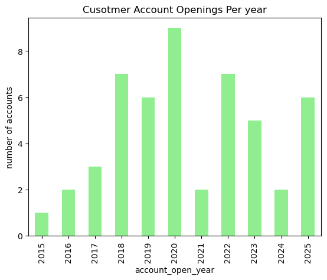
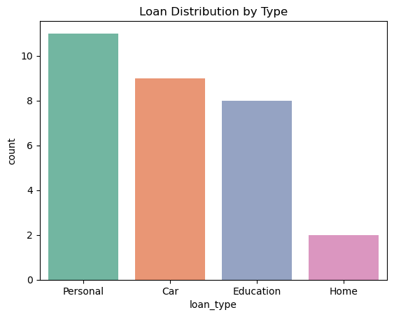
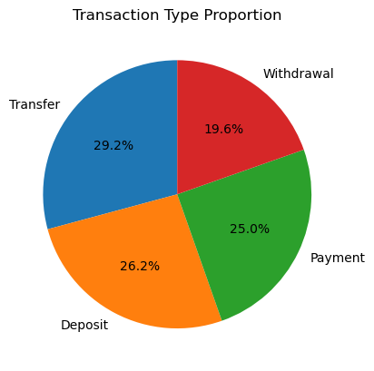

# Banking Analytics 


## Project Overview
This project simulates a **real-world banking system** with Customers, Accounts, Transactions, Loans, and CreditCards.  
It demonstrates **full-stack Data Engineering, Data Science, and Dashboarding skills**, including:

- Building a **relational database** (MySQL)
- Designing **data pipelines** for cleaning and aggregation
- Performing **EDA and visual analytics**

---

## 📂 Tech Stack
- **Database / ETL:** MySQL, Pandas, SQLAlchemy  
- **Data Analysis / Visualization:** Python, Pandas, Matplotlib, Seaborn  
- **Synthetic Data Generation:** Faker  

---

## Features

### Data Engineering (DE)
- Relational schema with **Customers, Accounts, Transactions, Loans, CreditCards**
- **ETL pipeline:** MySQL → Pandas → Cleaned CSVs
- Joins and aggregations for **customer profiles & KPIs**

### Data Science (DS)
- **EDA & Visualization**:
  - Customer demographics (age, account opening trends)
  - Account balances & distributions
  - Loan types & status
  - Credit card utilization
  - Transaction trends and types
  - Multi-table KPIs (balance vs loans vs credit usage)


## Example Insights
- Most customers are **25–45 years old**
- **Top 10 customers** hold disproportionately high balances (VIP segment)
- **Home and Personal Loans** dominate, majority approved
- **15–20% of credit card users** are above 80% utilization → high-risk
- Transactions are mostly **debit**, few failed transactions
- **Customer Segmentation** identifies potential VIP, standard, and high-risk groups

---

## Project Structure
```
banking-project/

│-── banking.sql     # Schema + queries
├── pipeline.ipynb      # ETL / data cleaning
├── populate.ipynb      # generate synthetic data
├── analysis.ipynb      # EDA + visualizations
└── README.md           # Project documentation
```

---

## Setup Instructions

1. **Clone repository**
```bash
git clone <your_repo_url>
cd banking-project
```

2. **Install dependencies**
```bash
pip install -r requirements.txt
```

3. **Create MySQL database**
```sql
source sql/banking.sql;
```

4. **Run ETL pipeline**
```bash
jupyter notebook pipeline.ipynb
```

5. **Run analysis**
```bash
jupyter notebook analysis.ipynb
```

---

## 📊 Visualizations

### Account Openings Distribution


### Loan Distribution


### Transaction Type



---

## Business Value
- Helps **bank managers identify VIP clients**
- Flags **high-risk credit card users**
- Automates **loan approval insights**
- Detects **fraudulent transactions** early
- Demonstrates **full DE + DS + ML workflow** on real-w